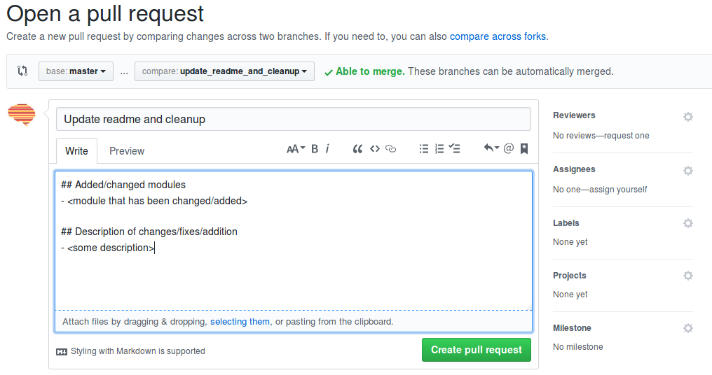

Spynoza
=======
Spynoza is a package for fMRI data (pre)processing developed by researchers affiliated with the `Spinoza Centre for
Neuroimaging <https://www.spinozacentre.nl/>`_, most prominently researchers from the `Donner Lab <http://wordpress.tobiasdonner.net/>`_ 
in Hamburg, the `Knapen lab <https://tknapen.github.io/>`_ (Free University Amsterdam), and the Scholte lab 
(University of Amsterdam). 

Status
------
.. image:: https://travis-ci.org/spinoza-centre/spynoza.svg?branch=develop
    :target: https://travis-ci.org/spinoza-centre/spynoza

.. image:: https://coveralls.io/repos/github/spinoza-centre/spynoza/badge.svg?branch=develop
    :target: https://coveralls.io/github/spinoza-centre/spynoza?branch=develop

Prerequisites
-------------
Spynoza uses Nipype to organize processing workflows, which in turns relies heavily on FSL and, for some
workflows, Freesurfer and AFNI.

Installation
------------
Spynoza is still (very much) in development, but if you want to try it out, you can install the master branch by::

    $ pip install git+https://github.com/spinoza-centre/spynoza.git@master

Contributing: setup and git workflow
------------------------------------
For contributors (within the Spinoza centre organization on Github), follow these guidelines to contribute to the repo.
First, `cd` to a folder where you want the spynoza git to be setup.
To clone the repo into that dir, run the following::

    $ git clone git@github.com:spinoza-center/spynoza.git`

This cloned the master branch into the repo. 

Now we'll want to create our own feature branch to start working on our
contribution. We can branch off of master by running::

    $ git checkout -b my_feature

By now, we created and switched to the new branch `my_feature`.
When working on your feature, make sure you first switch to your feature branch to
avoid changing the master branch accidentally.

Then, work on your feature and once you're done (and staged your changes) run::

    $ git commit -am "Your message"

When your feature is finished, and you'd like to share it with your collaborators,
first push it to Github::

    $ git push -u origin my_feature

Then, go to Github and propose a "pull request" (PR) by clicking on the
"New pull request" button (next to the "Branch" button). Then, choose
the master branch as "base" and your feature-branch as the "compare" branch,
write a short description of your implemented feature and how it impacts the
master branch, as indicated in the image below:

Finally, click the green "Create pull request" button to submit the PR.
One of the other Spynoza-members will review your PR and, if it seems sensible/doesn't break anything,
it will be accepted and merged into master! One way to check if your code doesn't break anything is to
run the ``run_tests.sh`` script, which triggers ``py.test`` to run all the tests in Spynoza. It would
be even better if you write new tests accompanying your new feature, such that we can check whether
future features impact/break your currect feature! Check the next section on how to write and run
tests for Spynoza.

Writing and running tests for Spynoza
-------------------------------------
Spynoza uses the ``py.test`` testing framework for running all unit-tests included in the package.
Currently, we also use `Travis-CI <https://travis-ci.org/>`_ for automatic testing ("continuous integration")
upon each push to master. If you want to run your tests locally, simply run::

    $ bash run_tests.sh

The ``run_tests.sh`` script is located in the root-directory of the Spynoza repo. Running the tests
locally assumes that you have installed the neuroimaging packages ``FSL``, ``AFNI``, and ``Freesurfer``,
and additionally the testing packages ``py.test``, ``pytest-cov``, and ``coveralls``. These can be installed
by::

    $ pip install pytest pytest-cov coveralls

In addition to the neuroimaging software and testing packages, make sure you have the regular dependencies
for Spynoza installed (``scikit-learn``, ``nibabel``, ``nipype``, ``scipy``, ``numpy``, ``pandas``).

If you want to write your own tests for your new or existing features (which we encourage!), check out the
`py.test website <https://docs.pytest.org/en/latest/>`_ and check out already existing test-modules in Spynoza
(which can be recognized by the ``test_*.py`` format)!

Writing documentation for Spynoza
---------------------------------
Currently, Spynoza uses Numpy-style docstrings (see `here <http://sphinxcontrib-napoleon.readthedocs.io/en/latest/example_numpy.html>`_
for an example), which can be converted to html-formatted documentation using `sphinx <http://www.sphinx-doc.org/en/stable/>`_
and subsequently served/deployed using Github-pages. Also, triple-quoted strings on top of your module are converted to
html-based documentation, so it's always a good idea to include some info about the module on the top of your file in
triple-quoted strings!
